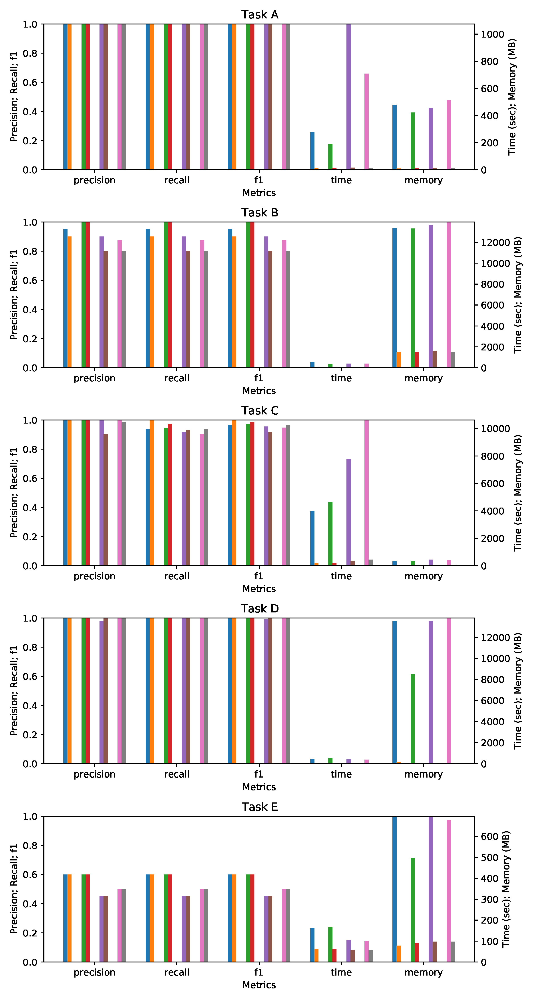

## Spatial Algorithms on Spatio Temporal Taxi Trajectories
- Improved query efficiency over 10^5 preprocessed trajectories via algorithms. Designed a spatio-temporal database
- Implemented algorithms: R-tree, balltree, kd tree, Hausdorff distance, and DTW distance in both Python and PostgreSQL
- Compared time/memory costs and performance metrics: precision/recall/f1, among algorithms and linear scan
- Results. Algorithm costs were less than 1/5 of those of linear scan. Metrics of both >0.85 with few gaps. Optimizing benchmark/distance conversion improved performance. Efficiently built belt queries on trajectory knn

